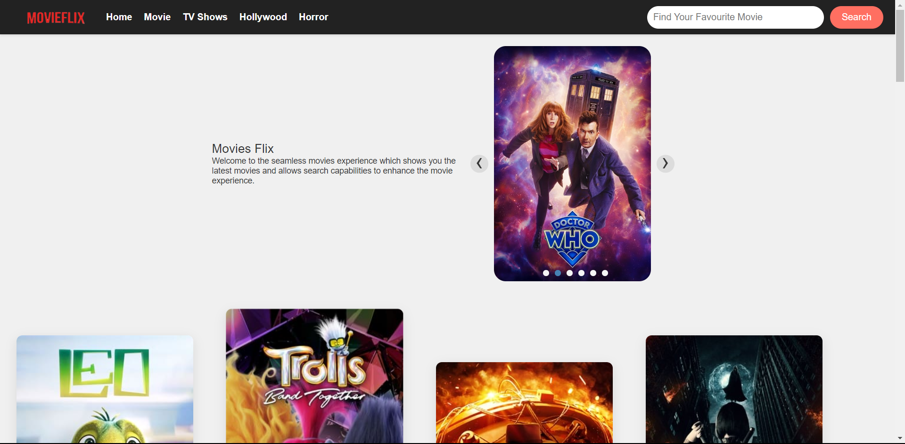

# MovieFlix App

Welcome to MovieFlix, your go-to application for real-time movie information. This React.js-based app seamlessly connects to a REST API to provide users with up-to-date details on their favorite movies. The front end is designed to offer a visually appealing and user-friendly experience.

## Features

- **Real-Time Movie Information:** Utilizes a REST API to fetch and display the latest movie data.

- **Sleek Front End:** Enjoy a great user interface designed with React.js for a smooth and engaging experience.

- **Responsive Design:** The app is crafted to be fully responsive, ensuring a seamless experience across devices.

## Getting Started

Follow these steps to set up MovieFlix on your local machine:

1. Clone the repository: `git clone https://github.com/kundnanl/movieflix.git`
2. Install dependencies: `npm install`
3. Configure the app to connect to your preferred REST API for movie information.
4. Run the app: `npm start`

For detailed instructions and additional configuration options, refer to the [Documentation](link-to-your-documentation).

## Screenshots

Happy Movie Watching!
